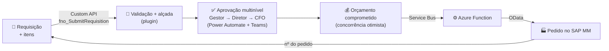
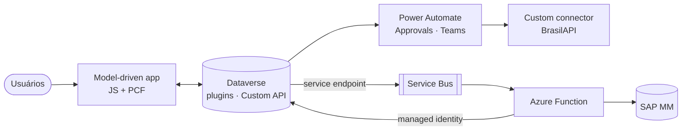

# SupplyFlow — Procure-to-Pay no Dataverse com integração SAP

[](https://github.com/faoneto/portfolio_francisco_neto_dev/actions/workflows/ci.yml)


Solução **Power Platform / Dynamics 365 (Dataverse)** de ponta a ponta para o processo de compras:
homologação de fornecedores, requisição de compra com **alçadas de aprovação e controle orçamentário**
e criação automática do **pedido de compra no SAP MM** — com plugins C#, Custom API, PCF, Client API em
TypeScript, Power Automate, custom connector, Azure Service Bus + Functions e **ALM completo**.

> **English summary** — End-to-end procure-to-pay solution on Microsoft Dataverse: C# plugins (state
> machine, approval matrix, optimistic concurrency), a bound Custom API, React/Fluent PCF controls,
> TypeScript form scripts, Power Automate multi-level approvals, a custom connector with C# custom code,
> and an Azure Service Bus → Azure Functions integration to SAP. Schema and plugin registration are
> code (idempotent deployer), tests run the plugin pipeline from the same registration file, and
> GitHub Actions promote a managed solution DEV → TEST → PROD.

---

## Por que este projeto

Trabalhei anos com compras, supply chain e SAP (MM/WMS) em multinacionais. O SupplyFlow modela o
problema que vi de perto — requisições por e-mail/planilha, alçada pouco clara, retrabalho de digitação
no ERP — e resolve com a arquitetura que um time de Dynamics 365 sênior usaria:
**low-code onde acelera, pro-code onde garante, tudo versionado e com pipeline.**

## O que ele faz



- **Fornecedores**: CNPJ validado no cliente (PCF) e no servidor (plugin), já compatível com o
  **CNPJ alfanumérico** da Receita (2026); duplicidade bloqueada; situação cadastral consultada na
  Receita via custom connector; homologação de materiais por fornecedor (N:N).
- **Requisições**: número automático, itens precificados pelo catálogo, total sempre consistente,
  máquina de estados com 7 etapas, **segregação de funções** (o requisitante não aprova a própria RC
  — nem pela API).
- **Alçadas**: matriz configurável (valor mínimo × grupo de material); acima do saldo do centro de
  custo escala para o CFO automaticamente.
- **Integração SAP**: assíncrona, idempotente, com retry, dead-letter, reprocessamento e log de negócio.
- **Kanban** (PCF) por etapa com arrastar-e-soltar que respeita as regras do servidor.

## Destaques técnicos

| Área | O que olhar |
|------|-------------|
| **Plugins C#** | [`PluginBase`](src/dataverse/SupplyFlow.Plugins/Core/PluginBase.cs) com guarda de registro, trace correlacionado, `ILogger` e tratamento de `FaultException` · [máquina de estados](src/dataverse/SupplyFlow.Plugins/Domain/RequisitionStateMachine.cs) · [concorrência otimista com `RowVersion`](src/dataverse/SupplyFlow.Plugins/Services/BudgetService.cs) · [FetchXML aggregate](src/dataverse/SupplyFlow.Plugins/Services/RequisitionRepository.cs) · [cache thread-safe de environment variables](src/dataverse/SupplyFlow.Plugins/Services/EnvironmentVariableService.cs) · multi-target `net462` (sandbox) + `net8.0` (testes) |
| **Custom API** | [`fno_SubmitRequisition`](src/dataverse/SupplyFlow.Plugins/CustomApis/SubmitRequisitionApi.cs) ligada à tabela, com saídas tipadas, chamada pelo command bar via `Xrm.WebApi.online.execute` |
| **Schema & registro como código** | [`schema.json`](src/dataverse/definitions/schema.json) + [`plugin-registration.json`](src/dataverse/definitions/plugin-registration.json) aplicados de forma idempotente pelo [`SupplyFlow.Deployer`](src/dataverse/SupplyFlow.Deployer) (tabelas, chaves alternativas compostas, N:N, steps, imagens, Custom API, service endpoint, web resources, seed com `Upsert` por alternate key) |
| **Testes** | 115 testes .NET com **FakeXrmEasy**, incluindo um cenário ponta a ponta no **pipeline simulado a partir do próprio JSON de registro** e testes de *drift* C# ↔ JSON ↔ TypeScript · 46 testes Jest |
| **Client API (TypeScript)** | [`requisition.form.ts`](src/webresources/src/forms/requisition.form.ts): `formContext`, `preventDefault` no OnSave, `addCustomFilter`, notificações — bundle por esbuild num namespace único |
| **PCF** | Controles **virtuais** (React 16 + Fluent UI v9 da plataforma): [`CnpjInput`](src/pcf/CnpjInput) e [`RequisitionKanban`](src/pcf/RequisitionKanban) (dataset, `getEntityMetadata`, `webAPI.updateRecord`, paging) |
| **Power Automate** | [Aprovação multinível](src/flows/SupplyFlow-AprovacaoRequisicao.json) com gatilho filtrado no servidor, Try/Catch, child flow reutilizável, connection references e environment variables |
| **Custom connector** | [BrasilAPI CNPJ](src/connectors/brasilapi-cnpj) com OpenAPI, *policy template* e **custom code em C#** |
| **Azure** | [Function .NET 8 isolated](src/integration/SupplyFlow.Integration) consumindo o `RemoteExecutionContext` do Service Bus com liquidação explícita (complete/abandon/dead-letter), `HttpClient` com pipeline de resiliência, **managed identity** para o Dataverse · [Bicep](infra/main.bicep) com RBAC de menor privilégio e Flex Consumption |
| **ALM** | [GitHub Actions](.github/workflows): CI com Solution Checker, deploy DEV, export → PR, release **gerenciado** TEST → PROD com aprovação e *deployment settings* |
| **Decisões** | 7 [ADRs](docs/adr) explicando os trade-offs (plugin × fluxo, rollup × plugin, Service Bus × webhook…) |

## Arquitetura



Detalhes: [docs/architecture.md](docs/architecture.md) · [modelo de dados](docs/data-model.md) ·
[segurança](docs/security-model.md) · [integração](docs/integration.md) · [ALM](docs/alm.md)

## Estrutura do repositório

```text
├── src/
│   ├── dataverse/
│   │   ├── definitions/              # schema.json + plugin-registration.json (estado desejado)
│   │   ├── SupplyFlow.Plugins/       # plugins C# + Custom API (net462 / net8.0)
│   │   ├── SupplyFlow.Plugins.Tests/ # xUnit + FakeXrmEasy (unitário, pipeline E2E, drift)
│   │   └── SupplyFlow.Deployer/      # schema / registro / web resources / seed como código
│   ├── webresources/                 # Client API em TypeScript (esbuild + Jest)
│   ├── pcf/                          # CnpjInput + RequisitionKanban (React + Fluent UI v9)
│   ├── flows/                        # definições e especificações dos fluxos
│   ├── connectors/brasilapi-cnpj/    # custom connector (OpenAPI + C# custom code)
│   └── integration/                  # Azure Function (Service Bus → SAP) + testes
├── infra/                            # Bicep (Service Bus, Function, identidade, RBAC, App Insights)
├── solution/                         # destino do unpack da solução exportada do DEV
├── deployment/settings/              # environment variables + connection references por ambiente
├── docs/                             # arquitetura, dados, segurança, ALM, integração, ADRs, guias
└── .github/workflows/                # CI · deploy-dev · export-solution · release
```

## Como rodar

```bash
# .NET – plugins, deployer, integração (115 testes)
dotnet test SupplyFlow.sln

# Web resources (TypeScript)
cd src/webresources && npm ci && npm test && npm run build

# PCF
cd src/pcf && npm ci && npm run build && npm test

# Aplicar no seu ambiente Dataverse (login interativo)
cd src/dataverse
dotnet run --project SupplyFlow.Deployer -- schema  --url https://<org>.crm2.dynamics.com
dotnet run --project SupplyFlow.Deployer -- plugins --url https://<org>.crm2.dynamics.com \
  --assembly SupplyFlow.Plugins/bin/Debug/net462/SupplyFlow.Plugins.dll
dotnet run --project SupplyFlow.Deployer -- seed    --url https://<org>.crm2.dynamics.com
```

Passo a passo completo (ambiente, app model-driven, fluxos, Azure, pipeline):
**[docs/setup-guide.md](docs/setup-guide.md)**.

## Cobertura PL-400

O projeto foi desenhado para exercitar as áreas do exame **PL-400 – Power Platform Developer**:
design técnico, soluções e ALM, Client API, PCF, plugins e Custom API, custom connectors, Power Automate
avançado e integrações com Azure. Mapa completo: [docs/pl400-coverage.md](docs/pl400-coverage.md).

## Roadmap

- [ ] Prints e vídeo da demo ([roteiro](docs/demo-script.md))
- [ ] Relatório Power BI embutido (lead time de aprovação, consumo de orçamento, falhas de integração)
- [ ] Retorno SAP → Dataverse (status do pedido e nota fiscal) usando a chave alternativa `fno_sappurchaseorder`
- [ ] Copilot/agent no app para consultar o status de requisições em linguagem natural
- [ ] Power Platform Pipelines nativo como alternativa ao GitHub Actions

## Autor

**Francisco Alves Oliveira Neto** — Desenvolvedor Power Platform Sênior · Belém/PA
[LinkedIn](https://linkedin.com/in/franciscoon)

## Licença

[MIT](LICENSE). Os testes usam [FakeXrmEasy](https://dynamicsvalue.github.io/fake-xrm-easy-docs/) v3 sob a
licença RPL-1.5 (uso em projeto open source).
