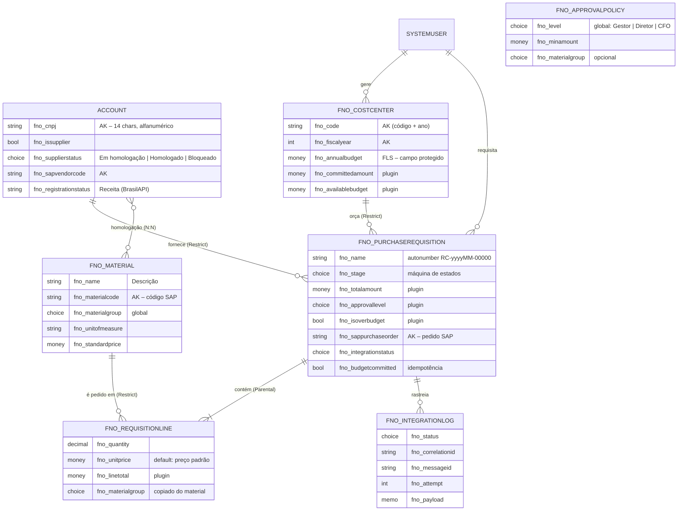

# Modelo de dados (Dataverse)

Fonte de verdade: [`src/dataverse/definitions/schema.json`](../src/dataverse/definitions/schema.json),
aplicado pelo `SupplyFlow.Deployer schema`. Prefixo do publisher: **`fno_`** (faixa de valores de
escolha `10000xxxx`).

## Tabelas

| Tabela | Propriedade | Por que assim |
|--------|-------------|---------------|
| `account` (estendida) | Usuário/equipe | Fornecedor é uma conta: reaproveita endereço, contatos, timeline e segurança do OOB. Só as colunas `fno_*` entram na solução (`DoNotIncludeSubcomponents`). |
| `fno_material` | Organização | Dado mestre espelhado do SAP MM; todos leem, só Suprimentos mantém. |
| `fno_costcenter` | Organização | Dado mestre financeiro; orçamento protegido por **field-level security**. |
| `fno_approvalpolicy` | Organização | Matriz de alçadas configurável pelo negócio, sem deploy. |
| `fno_purchaserequisition` | Usuário/equipe | Segurança por dono, BU e **hierarquia de gestores**; notas e atividades habilitadas. |
| `fno_requisitionline` | Usuário/equipe (Parental) | Segue o dono da requisição (assign/share/delete em cascata). |
| `fno_integrationlog` | Organização, sem auditoria | Alto volume, só leitura para suporte; a auditoria seria redundante e cara. |

## Chaves alternativas (alternate keys)

| Tabela | Chave | Uso |
|--------|-------|-----|
| `account` | `fno_cnpj` | Unicidade garantida pelo banco + `Upsert` na carga de fornecedores |
| `account` | `fno_sapvendorcode` | Integrações SAP → Dataverse referenciam o fornecedor pelo código SAP |
| `fno_material` | `fno_materialcode` | Carga do mestre de materiais via `UpsertRequest` sem GUID |
| `fno_costcenter` | `fno_code` + `fno_fiscalyear` | **Chave composta**: o mesmo centro de custo existe em cada ano fiscal |
| `fno_purchaserequisition` | `fno_sappurchaseorder` | Retorno do SAP (ex.: status do pedido/nota) localiza a RC pelo número do pedido |

O `SupplyFlow.Deployer seed` usa exatamente esse padrão (`new Entity("fno_material", "fno_materialcode", code)` +
`UpsertRequest`) — o mesmo que uma integração de dados mestres usaria.

## Relacionamentos e comportamento em cascata

| Relacionamento | Tipo | Delete | Racional |
|----------------|------|--------|----------|
| Requisição → Itens | 1:N **Parental** | Cascade | Item não existe sem requisição; o plugin de totais ignora o delete em cascata (`IsCascadeDeleteFrom`). |
| Fornecedor → Requisições | 1:N Referential | **Restrict** | Não se exclui fornecedor com histórico de compras — bloqueia-se (status *Bloqueado*). |
| Centro de custo → Requisições | 1:N Referential | **Restrict** | Integridade do histórico orçamentário. |
| Material → Itens | 1:N Referential | **Restrict** | Idem. |
| Fornecedor ↔ Material | **N:N nativo** (`fno_account_fno_material`) | — | Homologação de materiais por fornecedor; consultado pelo plugin de itens via tabela de interseção. |

## Colunas calculadas por plugin vs. calculated/rollup/formula

`fno_totalamount`, `fno_committedamount`, `fno_availablebudget`, `fno_approvallevel` são **mantidas por
plugin** de forma síncrona e transacional. Rollups são assíncronos e *formula columns* não agregam linhas
filhas — e a alçada de aprovação não pode ser calculada sobre um total desatualizado
([ADR 0002](adr/0002-header-totals-sync-plugin.md)).

## Variáveis de ambiente

| Schema name | Tipo | Uso |
|-------------|------|-----|
| `fno_RequireSupplierMaterialApproval` | Sim/Não | Liga/desliga a exigência da homologação N:N (plugin, com cache de 5 min) |
| `fno_SapIntegrationEnabled` | Sim/Não | Marca RCs aprovadas como *Na fila* para a integração |
| `fno_ApprovalTimeoutDays` | Número | Escalonamento de aprovações pendentes (F3) |
| `fno_ApprovalRouting` | JSON | Aprovadores dos níveis Diretor e CFO (F1) |
| `fno_ProcurementTeamsChannel` | JSON | Canal do Teams das notificações (F5) |
| `fno_AppUrl` | Texto | Links profundos para registros nas aprovações |
