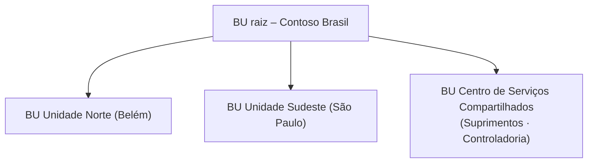

# Modelo de segurança

## Estrutura organizacional

- **Business units por unidade fabril**: requisitantes enxergam as requisições da própria unidade.
- **Hierarquia de gestores (Manager hierarchy security)**: o gestor lê/edita requisições dos
  subordinados diretos e indiretos (profundidade 3) sem precisar de privilégio de BU inteira.
- **Owner teams** por planta para requisições compartilhadas (ex.: compras de manutenção da linha 2).

## Papéis (security roles)

Níveis: 👤 Usuário · 🏢 Unidade de negócio · 🌳 BU pai:filha · 🌐 Organização · — nenhum

| Tabela | Requisitante | Gestor / Aprovador | Comprador (Suprimentos) | Controladoria | Integração (app user) |
|--------|:-:|:-:|:-:|:-:|:-:|
| Requisição – Create | 👤 | 👤 | 🌐 | — | — |
| Requisição – Read | 👤 | 🌳 + hierarquia | 🌐 | 🌐 | 🌐 |
| Requisição – Write | 👤 | 🌳 + hierarquia | 🌐 | — | 🌐 |
| Requisição – Delete | 👤 *(rascunho¹)* | — | — | — | — |
| Item da requisição | = requisição (Parental) | = requisição | 🌐 | 🌐 Read | 🌐 Read |
| Fornecedor (account) | 🌐 Read | 🌐 Read | 🌐 CRUD + Append/AppendTo | 🌐 Read | 🌐 Read |
| Material / homologação N:N | 🌐 Read | 🌐 Read | 🌐 CRUD + Associate | 🌐 Read | 🌐 Read |
| Centro de custo | 🏢 Read | 🏢 Read | 🌐 Read | 🌐 CRUD | 🌐 Read |
| Alçada de aprovação | — | 🌐 Read | 🌐 Read | 🌐 CRUD | — |
| Log de integração | — | — | 🌐 Read | — | 🌐 Create/Read |

¹ A exclusão fica restrita a rascunhos por regra de negócio: itens só podem ser alterados/excluídos em
*Rascunho* ou *Rejeitada* (plugins), e o formulário bloqueia campos fora dessas etapas.

### Princípios aplicados

- **Menor privilégio**: a identidade da Azure Function (Application User) não tem papel de
  administrador — só o necessário para ler a requisição e gravar o resultado/log.
- **Plugins não escalam privilégio sem motivo**: leituras de dado de referência e cálculos derivados usam
  o serviço SYSTEM (`CreateOrganizationService(null)`), mas a operação de negócio
  (`fno_SubmitRequisition`) atualiza a requisição **como o usuário chamador** — se ele não pode editar
  a RC, a Custom API falha.
- **Duplicidade de CNPJ verificada como SYSTEM**: o usuário pode não ter leitura do fornecedor que já
  possui o CNPJ; mesmo assim a mensagem amigável é exibida (a chave alternativa garante a unicidade).

## Segregação de funções (SoD)

| Controle | Implementação |
|----------|---------------|
| Requisitante não aprova/rejeita a própria RC | `RequisitionLifecyclePlugin.EnsureSegregationOfDuties` compara `InitiatingUserId` com `fno_requesterid` — vale para formulário, Web API, fluxo e Kanban |
| Valor e alçada não podem ser manipulados pelo cliente | `fno_totalamount`, `fno_approvallevel`, `fno_isoverbudget` são recalculados pelo plugin na submissão |
| Pedido SAP só é concluído com número válido | Transição para *Pedido criado* exige `fno_sappurchaseorder` |
| Histórico de aprovação | Respostas do Approvals gravadas em `fno_approvalnotes` + auditoria do Dataverse nas colunas críticas |

## Field-level security

- Perfil **"SupplyFlow – Orçamento"**: Read/Update em `fno_costcenter.fno_annualbudget` para
  Controladoria; Read para Diretores. Os demais usuários veem o campo mascarado.
- `fno_committedamount`/`fno_availablebudget` ficam visíveis (transparência do saldo), mas só o plugin
  grava (campos somente leitura no formulário).

## Identidades técnicas

| Identidade | Onde | Autenticação |
|------------|------|--------------|
| Pipeline GitHub → Power Platform | App registration + Application User (papel *System Customizer* no DEV; *deployment* nos demais) | Client secret em GitHub Secrets (ou federated credentials) |
| Pipeline GitHub → Azure | App registration com **OIDC federado** | Sem segredo armazenado |
| Azure Function → Dataverse | **User-assigned managed identity** registrada como Application User | Token via `DefaultAzureCredential` |
| Azure Function → Service Bus / Storage | Mesma managed identity | RBAC: *Service Bus Data Receiver*, *Storage Blob/Queue/Table Data* |
| Dataverse → Service Bus | Service endpoint | SAS **somente Send**, escopo da fila |
