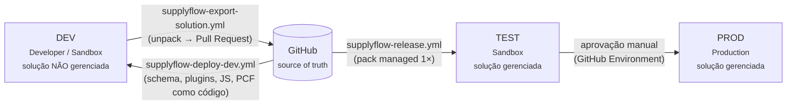

# ALM – Application Lifecycle Management

## Ambientes

| Ambiente | Tipo | Solução | Quem altera |
|----------|------|---------|-------------|
| DEV | Developer/Sandbox | **Não gerenciada** | Desenvolvedores e makers |
| TEST | Sandbox | **Gerenciada** | Somente pipeline |
| PROD | Production | **Gerenciada** | Somente pipeline (com aprovação) |

Regras: nada é customizado direto em TEST/PROD (*no unmanaged layers*); configuração específica de
ambiente vem de **environment variables** e **connection references** preenchidas pelo
`deployment/settings/<ambiente>.json`.

## O que é código e o que é exportado

| Artefato | Autoria | Como chega ao Git |
|----------|---------|-------------------|
| Tabelas, colunas, choices, chaves, relacionamentos, variáveis de ambiente | `schema.json` | Diretamente (código) |
| Plugins, steps, imagens, Custom API, service endpoint | C# + `plugin-registration.json` | Diretamente (código) |
| Web resources | TypeScript | Diretamente (código) → bundle no CI |
| PCF | TypeScript/React | Diretamente (código) |
| Formulários, views, app model-driven, sitemap, BPF, business rules, dashboards, comandos | Maker portal (DEV) | `supplyflow-export-solution.yml` → `solution/src` via PR |
| Fluxos, connection references, custom connector | Maker portal / `pac connector` (DEV) | `supplyflow-export-solution.yml` → `solution/src` via PR |
| Infraestrutura Azure | Bicep | Diretamente (código) |

O pacote **gerenciado** promovido é sempre gerado a partir de `solution/src` — o mesmo artefato vai para
TEST e PROD (*build once, deploy many*).

## Workflows

| Workflow | Gatilho | O que faz |
|----------|---------|-----------|
| [`supplyflow-ci.yml`](../../.github/workflows/supplyflow-ci.yml) | PR e push na `main` | Build `net462`/`net8.0`, 95+ testes .NET, validação das definições, lint/typecheck/test/build TypeScript, build PCF, Bicep build/lint, JSON, **Solution Checker** |
| [`supplyflow-deploy-dev.yml`](../../.github/workflows/supplyflow-deploy-dev.yml) | Manual | `Deployer schema` → `plugins` → `webresources` → (`seed`) → `pac pcf push` |
| [`supplyflow-export-solution.yml`](../../.github/workflows/supplyflow-export-solution.yml) | Manual (com versão) | Carimba versão, exporta gerenciada + não gerenciada, `unpack --packagetype Both`, abre PR |
| [`supplyflow-release.yml`](../../.github/workflows/supplyflow-release.yml) | Tag `supplyflow-v*` | Pack gerenciado, publish da Function; TEST (Bicep + Function + import) → aprovação → PROD |

### Import em produção

- `stage-and-upgrade: true` → **Stage for upgrade + Apply upgrade**: componentes removidos da solução
  também são removidos do ambiente (um "update" simples deixaria lixo).
- `activate-plugins: true` e `publish-changes: true`.
- `use-deployment-settings-file` preenche connection references e environment variables — os fluxos
  ligam sozinhos, sem intervenção manual.

## Segredos e variáveis do GitHub

| Nome | Tipo | Escopo |
|------|------|--------|
| `PP_APP_ID`, `PP_CLIENT_SECRET`, `PP_TENANT_ID` | Secret | Por *environment* (dev/test/prod) |
| `DEV_ENVIRONMENT_URL` / `ENVIRONMENT_URL` | Variable | Por *environment* |
| `AZURE_CLIENT_ID`, `AZURE_TENANT_ID`, `AZURE_SUBSCRIPTION_ID` | Secret | OIDC (federated credential) |
| `AZURE_RESOURCE_GROUP`, `FUNCTION_APP_NAME`, `SAP_BASE_URL` | Variable | Por *environment* |
| `SERVICEBUS_NAMESPACE` (var), `SERVICEBUS_DATAVERSE_SASKEY` (secret) | — | DEV (registro do service endpoint) |

Configure *required reviewers* no environment `prod`.

## Versionamento

- **Solução**: `major.minor.build.revision`, carimbada no export (`set-online-solution-version`).
- **Assembly de plugin**: `AssemblyVersion` fixa em `1.0.0.0` — mudar major/minor cria um *novo*
  plugin assembly no Dataverse e quebra os steps registrados; a evolução vai no `FileVersion`.
- **PCF**: versão no `ControlManifest.Input.xml` (incremente o *patch* a cada deploy para forçar o
  refresh de cache no cliente).

## Estratégia de branches

- `main` protegida: PR obrigatório + CI verde.
- PRs de export (`supplyflow/solution/export-x.y.z.w`) são revisados como código: diffs de XML de formulário e de
  JSON de fluxo ficam legíveis porque o unpack separa cada componente em arquivo próprio.
- Tag `supplyflow-vX.Y.Z` dispara o release.

## Próximos passos possíveis

- **Power Platform Pipelines** (nativo) ou **Azure DevOps** com as mesmas etapas (o cronograma de estudo
  cita Azure DevOps — os passos são equivalentes às *Power Platform Build Tools*).
- `pac solution pack --map` para substituir o `.dll` do plugin no pacote pelo build do CI.
- Managed Environments + políticas de DLP por ambiente.
