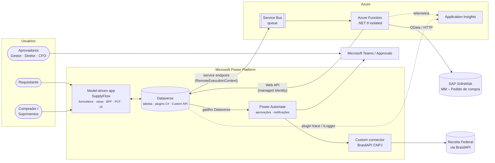
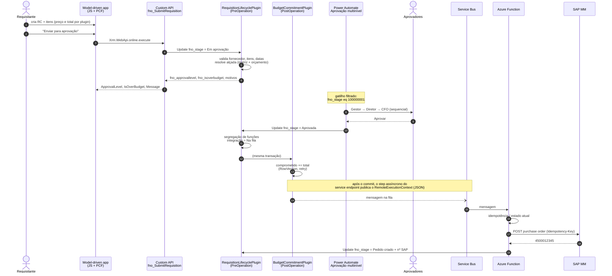

# Arquitetura

## 1. Contexto

O SupplyFlow cobre o **procure-to-pay** até a criação do pedido no ERP: homologação de fornecedores,
requisição de compra, aprovação por alçada com controle orçamentário e integração com o SAP (MM).

## 2. Onde mora cada regra (e por quê)

| Responsabilidade | Onde | Motivo |
|------------------|------|--------|
| Validação de CNPJ, duplicidade | Plugin **PreValidation** (`ValidateSupplierCnpjPlugin`) + PCF/JS para feedback imediato | O servidor é a única barreira que vale para formulário, import, Web API e fluxos. O cliente só melhora a UX. |
| Preço/total do item | Plugin **PreOperation** (`RequisitionLinePricingPlugin`) | Escreve no `Target` antes de gravar: zero updates extras. |
| Total da requisição | Plugin **PostOperation síncrono** (`RequisitionLineTotalsPlugin`) | Dentro da transação; rollup seria assíncrono (até 12 h) e a alçada depende do total — [ADR 0002](adr/0002-header-totals-sync-plugin.md). |
| Máquina de estados, alçada, segregação de funções | Plugin **PreOperation** (`RequisitionLifecyclePlugin`) | Uma única fonte de verdade para qualquer canal — [ADR 0001](adr/0001-business-logic-in-plugins.md), [ADR 0006](adr/0006-custom-stage-state-machine.md). |
| Comprometimento de orçamento | Plugin **PostOperation** (`RequisitionBudgetCommitmentPlugin`) com concorrência otimista | Duas aprovações simultâneas no mesmo centro de custo não podem perder atualização. |
| "Enviar para aprovação" | **Custom API** `fno_SubmitRequisition` (ligada à tabela) | Operação de negócio nomeada, com saída tipada, reutilizável por botão, fluxo e sistemas externos. |
| Orquestração de pessoas (aprovação multinível, lembretes) | **Power Automate** | Approvals + Teams são o ponto forte do low-code; o fluxo não decide regra, só lê `fno_approvallevel`. |
| Integração com SAP | **Service endpoint → Service Bus → Azure Function** | Assíncrono, desacoplado, com retry/DLQ e sem segurar a transação do Dataverse — [ADR 0005](adr/0005-sap-integration-service-bus.md). |
| Situação cadastral na Receita | **Custom connector** + fluxo | Reuso, governança por DLP e contrato estável — [conector](../src/connectors/brasilapi-cnpj/README.md). |

## 3. Pipeline de eventos de uma requisição

## 4. Componentes de código

| Pasta | Tecnologia | Destaques |
|-------|------------|-----------|
| [`src/dataverse/SupplyFlow.Plugins`](../src/dataverse/SupplyFlow.Plugins) | C# – `net462` (sandbox) e `net8.0` (testes) | `PluginBase` com guarda de registro, telemetria `ILogger`, tratamento de `FaultException`; domínio puro (`Cnpj`, `RequisitionStateMachine`, `ApprovalPolicyResolver`) separado do pipeline |
| [`src/dataverse/SupplyFlow.Deployer`](../src/dataverse/SupplyFlow.Deployer) | C# .NET 8 + `ServiceClient` | Schema, steps, imagens, Custom API, service endpoint, web resources e dados de exemplo **como código**, idempotente — [ADR 0004](adr/0004-schema-and-registration-as-code.md) |
| [`src/dataverse/definitions`](../src/dataverse/definitions) | JSON | `schema.json` e `plugin-registration.json`: o estado desejado do ambiente |
| [`src/dataverse/SupplyFlow.Plugins.Tests`](../src/dataverse/SupplyFlow.Plugins.Tests) | xUnit + FakeXrmEasy v3 | Testes de domínio, de plugin, **ponta a ponta com pipeline simulado a partir do JSON de registro** e testes de *drift* entre C# e JSON |
| [`src/webresources`](../src/webresources) | TypeScript + esbuild + Jest | Client API moderna (`formContext`, `preventDefault`, `addCustomFilter`, `Xrm.WebApi.online.execute`) |
| [`src/pcf`](../src/pcf) | PCF virtual controls (React 16 + Fluent UI v9 da plataforma) | `CnpjInput` (campo) e `RequisitionKanban` (dataset com arrastar-e-soltar) |
| [`src/flows`](../src/flows) | Power Automate | Aprovação multinível com Try/Catch, child flow de notificação |
| [`src/connectors`](../src/connectors) | OpenAPI 2.0 + C# custom code | BrasilAPI CNPJ |
| [`src/integration`](../src/integration) | Azure Functions (.NET 8 isolated) | Service Bus trigger, liquidação explícita (complete/abandon/dead-letter), `HttpClient` com pipeline de resiliência, mock do SAP |
| [`infra`](../infra) | Bicep | Service Bus, Function App Flex Consumption, managed identity, RBAC de menor privilégio, App Insights |
| [`.github/workflows`](../../.github/workflows) | GitHub Actions + Power Platform Actions | CI, deploy DEV, export para PR, release gerenciado TEST → PROD |

## 5. Requisitos não funcionais

- **Desempenho**: steps de Update sempre com *filtering attributes*; imagens só com as colunas usadas;
  agregação no servidor (FetchXML `aggregate`) em vez de paginar itens; `ColumnSet` explícito em toda
  consulta; nada de `ColumnSet(true)` em código de produção.
- **Limites da plataforma**: plugins síncronos curtos (sem chamadas HTTP — a integração é assíncrona);
  fluxos com gatilho filtrado para não consumir *Power Platform requests* à toa.
- **Concorrência**: `RowVersion` + `ConcurrencyBehavior.IfRowVersionMatches` no orçamento.
- **Idempotência**: flag `fno_budgetcommitted`, checagem de `fno_sappurchaseorder` antes de chamar o SAP,
  `Idempotency-Key` no HTTP e *duplicate detection* na fila.
- **Observabilidade**: trace de plugin com correlação, `ILogger` (Application Insights) nos plugins,
  telemetria da Function, tabela `fno_integrationlog` para o negócio e fluxo F6 de alerta.
- **Segurança**: managed identity no Azure (sem segredo), SAS *send-only* por fila para o Dataverse,
  segregação de funções no servidor, field-level security no orçamento — ver [security-model.md](security-model.md).
